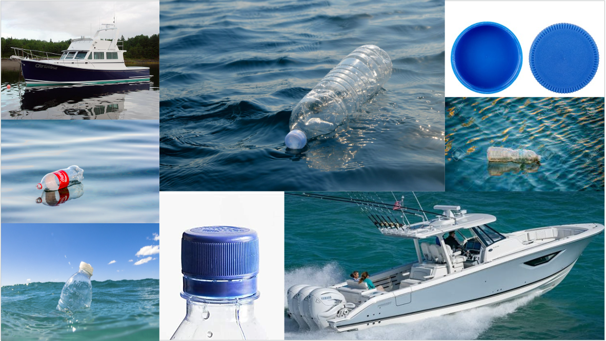
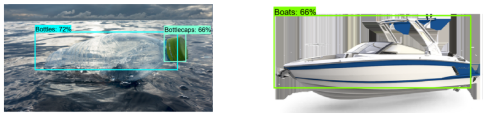

# JADE: Real-Time Object Detection for Marine Debris Management 

J.A.D.E (Just Another Detection Equipment) is an object detection project designed to identify and classify surface-level marine debris, focusing on pollutants such as bottles, bottle caps, and boats. The system is an integral part of a larger initiative called O.T.R (Ocean Trash Recycler), aligned with the UAE’s national agenda for a sustainable environment and infrastructure. 

The core of the system is built on SSD-Mobilenet architecture, accessed through the TensorFlow Model Zoo, a powerful and lightweight model that allows for high-speed processing. The TensorFlow Object Detection API enhances the model's performance, enabling rapid and reliable identification of debris on a curated dataset, annotated through LabelImg. 

### Dataset 



- **Dataset Size**: 300
- **Data Source**: Bulk download from Google Images
- **Annotation Tool**: Annotations were performed using the [LabelImg tool](https://github.com/HumanSignal/labelImg)

## Results


## Installation 

1. Clone the repository and change directory

    ```bash
    git clone https://github.com/SaniaE/image-captioning.git
    cd path/to/repo/clone
    ```
2. Create and activate a new virtual enviornment

    ```bash
    python -m venv <environment_name>
    .\<environment_name>\Scripts\activate   # For Windows
    source <environment_name>/bin/activate  # For macOS/Linux
    ```
3. Add virtual environment to the Python Kernel 

    ```bash
    python -m pip install --upgrade pip 
    pip install ipykernel 
    python -m ipykernel install --user --name=<kernel_name>
    ```
4. Install dependencies

    ```bash
    pip install -r requirements.txt
    ```
5. Launch Jupyter Notebook 

    ```bash
    jupyter notebook
    
6. About the notebooks:
    - `Data_Annotations.ipynb` guides through setting up the annotation environment, covering annotation tool configuration, and launches the tool to annotate images required for object detection
    - `Training.ipynb` details the process of training the object detection model. It includes steps for data loading, creating TFRecords and label maps, downloading a pretrained model, setting up the configuration, and running the training process using the appropriate commands. 
    - `Evaluation.ipynb` outlines the steps for loading the trained model, performing inference, and evaluating the model's performance on unseen data.